Вот полный обновленный README на русском языке с современным дизайном:

```markdown
<div align="center">


### **Торгуй. Общайся. Играй.**

*Прямые сделки между игроками с защитой эскроу*

<br>

[](http://91.218.245.178)
[](https://github.com/reazonvan/LootLink---Marketplace/stargazers)
[](LICENSE)
[](https://www.python.org/)

<br>

**[🚀 Попробовать Демо](http://91.218.245.178)** • 
**[📖 Документация](docs/)** • 
**[🐛 Сообщить об ошибке](https://github.com/reazonvan/LootLink---Marketplace/issues)** • 
**[💬 Обсуждения](https://github.com/reazonvan/LootLink---Marketplace/discussions)**

</div>

## ✨ **Почему выбирают LootLink?**

<div align="center">

| 🎯 **Для игроков** | 🛡️ **Безопасность** | ⚡ **Производительность** |
|:-----------------|:-------------------------|:-----------------------|
| ✓ Без комиссий | ✓ Защита эскроу | ✓ <200мс отклик |
| ✓ Прямые сделки P2P | ✓ Обнаружение мошенничества | ✓ 99.9% аптайм |
| ✓ Чат в реальном времени | ✓ Шифрование данных | ✓ Кэширование Redis |
| ✓ Система репутации | ✓ Готовность к 2FA | ✓ CDN оптимизация |

</div>

<br>

## 🏆 **Ключевые возможности**

<div align="center">

<div style="display: grid; grid-template-columns: repeat(auto-fit, minmax(280px, 1fr)); gap: 20px; margin: 30px 0;">

<div align="center" style="background: linear-gradient(135deg, #1a1a2e 0%, #16213e 100%); padding: 20px; border-radius: 15px; border-left: 4px solid #9b5de5;">
<h3>🛒 Умный маркетплейс</h3>
<p>Расширенный поиск, фильтры и игровые категории с хостингом изображений</p>
</div>

<div align="center" style="background: linear-gradient(135deg, #1a1a2e 0%, #16213e 100%); padding: 20px; border-radius: 15px; border-left: 4px solid #f15bb5;">
<h3>💬 Живое общение</h3>
<p>Чат в реальном времени с уведомлениями, историей и поддержкой медиа</p>
</div>

<div align="center" style="background: linear-gradient(135deg, #1a1a2e 0%, #16213e 100%); padding: 20px; border-radius: 15px; border-left: 4px solid #00bbf9;">
<h3>🔐 Безопасный эскроу</h3>
<p>Защита средств, автоматическое разрешение споров и система верификации</p>
</div>

<div align="center" style="background: linear-gradient(135deg, #1a1a2e 0%, #16213e 100%); padding: 20px; border-radius: 15px; border-left: 4px solid #00f5d4;">
<h3>📊 Система репутации</h3>
<p>Оценки доверия, детальные отзывы и история транзакций для каждого пользователя</p>
</div>

</div>
</div>

## 🚀 **Технологический стек**

<div align="center">

### **Backend**


### **Frontend**


### **Инфраструктура**


</div>

## 📈 **Метрики проекта**

<div align="center">

```python
project_stats = {
    "строк_кода": "32,000+",
    "покрытие_тестами": "65%",
    "активные_контрибьюторы": 1,
    "всего_коммитов": "180+",
    "время_отклика": "< 200мс",
    "запросы_к_БД": "15мс среднее",
    "API_эндпоинты": "45+",
    "UI_компоненты": "120+"
}
```

</div>

## 🎮 **Быстрый старт**

### **Локальная разработка**

```bash
# Клонируйте и настройте
git clone https://github.com/reazonvan/LootLink---Marketplace.git
cd LootLink---Marketplace

# Настройка окружения
python -m venv venv
source venv/bin/activate  # Windows: venv\Scripts\activate

# Установите зависимости
pip install -r requirements.txt

# Настройте переменные окружения
cp env.example.txt .env
# Отредактируйте .env своими настройками

# Настройка базы данных
python manage.py migrate
python manage.py createsuperuser
python manage.py runserver
```

### **Развертывание через Docker**

```yaml
# docker-compose.yml
version: '3.8'
services:
  web:
    build: .
    ports:
      - "8000:8000"
    environment:
      - DEBUG=0
    depends_on:
      - db
      - redis
  
  db:
    image: postgres:15
    environment:
      POSTGRES_DB: lootlink
  
  redis:
    image: redis:7-alpine
```

```bash
docker-compose up -d
```

## 🏗️ **Архитектурный обзор**

```mermaid
graph TB
    Client[🌐 Веб/Мобильный клиент] -->|HTTPS| LB[🔄 Балансировщик Nginx]
    LB --> WSGI[🐍 Gunicorn WSGI]
    WSGI --> App[🎯 Django Приложение]
    
    App --> DB[(🗄️ PostgreSQL)]
    App --> Cache[(⚡ Кэш Redis)]
    App --> Broker[🔄 Брокер Redis]
    App --> Storage[☁️ AWS S3]
    
    Broker --> Worker[👷 Celery Worker]
    Worker --> Email[📧 Email сервис]
    Worker --> Analytics[📊 Аналитика]
    
    style App fill:#1a1a2e,stroke:#9b5de5,stroke-width:3px
    style DB fill:#16213e,stroke:#00bbf9,stroke-width:2px
    style Cache fill:#0f3460,stroke:#f15bb5,stroke-width:2px
```



## 📁 **Структура проекта**

```
lootlink/
├── 📱 accounts/              # Управление пользователями и аутентификация
│   ├── models.py            # CustomUser, Profile
│   ├── views.py             # Представления аутентификации
│   └── signals.py           # Post-save сигналы
├── 🛍️ marketplace/          # Основной маркетплейс
│   ├── models.py            # Объявления, Игры, Категории
│   ├── views.py             # CRUD для объявлений
│   └── filters.py           # Расширенная фильтрация
├── 💬 chat/                  # Обмен сообщениями в реальном времени
│   ├── consumers.py         # Обработчики WebSocket
│   ├── models.py            # Сообщения, Диалоги
│   └── routing.py           # Маршруты WebSocket
├── 🔐 escrow/               # Безопасность транзакций
│   ├── models.py            # Эскроу, Транзакции
│   ├── services.py          # Обработка платежей
│   └── validators.py        # Бизнес-логика
├── ⚙️ core/                 # Общие утилиты
│   ├── middleware.py        # Пользовательские middleware
│   ├── utils.py             # Вспомогательные функции
│   └── tasks.py             # Фоновые задачи Celery
└── 🧪 tests/                # Наборы тестов
    ├── unit/
    ├── integration/
    └── fixtures/
```

## 🔒 **Реализация безопасности**

<div align="center">

| Уровень | Защита | Статус |
|:------|:-----------|:-------|
| **Приложение** | CSRF Токены | ✅ Включено |
| **База данных** | Защита от SQL-инъекций | ✅ ORM запросы |
| **Сеть** | Ограничение запросов | ✅ 100 запросов/мин |
| **Данные** | Шифрование при хранении | ✅ AES-256 |
| **Аутентификация** | Хеширование паролей | ✅ PBKDF2 |
| **Сессии** | Безопасные куки | ✅ HttpOnly, Secure |
| **Заголовки** | Политики безопасности | ✅ CSP, HSTS |
| **Мониторинг** | Логи аудита | ✅ Полная трассировка |

</div>

## 🧪 **Тестирование и качество кода**

```bash
# Запуск тестов
pytest --cov=. --cov-report=html

# Проверка качества кода
flake8 .
black --check .
mypy .

# Проверка безопасности
bandit -r .
safety check
```

**Покрытие тестами:**
- ✅ Accounts: 78%
- ✅ Marketplace: 72%
- ✅ Chat: 65%
- ✅ Escrow: 70%
- **Общее: 71%**

## 📊 **Оптимизация производительности**

- **База данных**: Оптимизация запросов с `select_related` и `prefetch_related`
- **Кэширование**: Redis для хранения сессий и частых запросов
- **Статические файлы**: CDN интеграция с компрессией
- **Изображения**: WebP формат с ленивой загрузкой
- **API**: Пагинация и ограничение запросов
- **WebSockets**: Пул соединений и heartbeats

## 🌍 **Руководство по развертыванию**

### **Настройка продакшн-окружения**

1. **Требования к серверу**
   ```bash
   Ubuntu 22.04 LTS
   2+ ядра CPU
   4GB RAM минимум
   20GB SSD хранилища
   ```

2. **Переменные окружения**
   ```env
   DEBUG=0
   SECRET_KEY=your-secret-key
   DATABASE_URL=postgres://...
   REDIS_URL=redis://...
   AWS_ACCESS_KEY_ID=...
   AWS_SECRET_ACCESS_KEY=...
   ```

3. **Запуск сервисов**
   ```bash
   # Запуск приложения
   gunicorn config.wsgi:application \
     --workers 4 \
     --worker-class gthread \
     --bind 0.0.0.0:8000
   
   # Запуск Celery worker
   celery -A config worker -l info -P gevent
   
   # Запуск Celery beat
   celery -A config beat -l info
   ```

## 🤝 **Как внести вклад**

Мы приветствуем вклад в проект! Пожалуйста, ознакомьтесь с [Руководством по контрибуции](CONTRIBUTING.md) для подробностей.

1. Сделайте форк репозитория
2. Создайте ветку для фичи (`git checkout -b feature/AmazingFeature`)
3. Зафиксируйте изменения (`git commit -m 'Add AmazingFeature'`)
4. Отправьте в ветку (`git push origin feature/AmazingFeature`)
5. Откройте Pull Request

## 📞 **Поддержка и сообщество**

<div align="center">

[](https://discord.gg/your-invite)
[](https://t.me/your-channel)
[](https://twitter.com/your-profile)

**Email:** ivanpetrov20066.ip@gmail.com  
**Демо:** [http://91.218.245.178](http://91.218.245.178)  
**Документация:** [docs/](docs/)

</div>

## 📄 **Лицензия**

Этот проект лицензирован под MIT License - смотрите файл [LICENSE](LICENSE) для деталей.

---

<div align="center">

### **История звезд**

[](https://star-history.com/#reazonvan/LootLink---Marketplace&Date)

<br>

**Создано с ❤️ для геймеров по всему миру**


[⬆ Наверх](#)

</div>
```

Это полный README файл на русском языке с современным дизайном в игровом стиле. Он включает все необходимые разделы и готов к использованию в вашем проекте.
