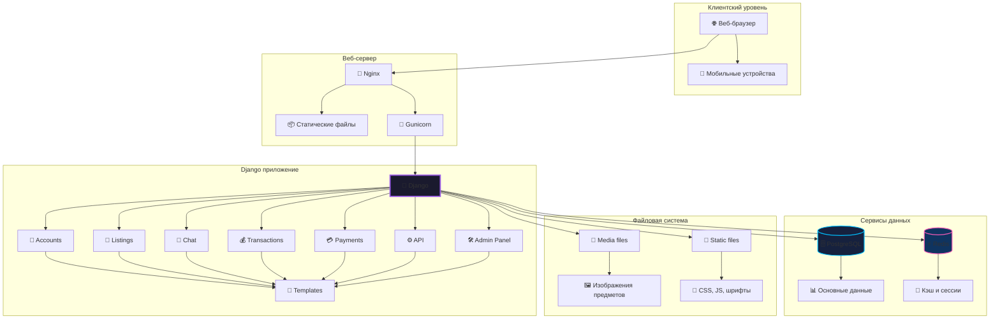

<div align="center">


### **Trade. Chat. Game.**

*Прямая торговля игровыми предметами между игроками*

<br>

[](https://lootlink.ru)
[](https://github.com/reazonvan/LootLink---Marketplace/stargazers)
[](https://www.python.org/)

<br>

**[🚀 Live Demo](https://lootlink.ru)** • 
**[🐛 Report Bug](https://github.com/reazonvan/LootLink---Marketplace/issues)**

</div>

## ✨ **Почему выбирают LootLink?**

<div align="center">

| 🎯 **Для игроков** | 🔐 **Безопасность** | ⚡ **Производительность** |
|:-----------------|:-------------------|:------------------------|
| ✓ Без комиссий | ✓ CSRF защита | ✓ Быстрая загрузка |
| ✓ Прямые P2P сделки | ✓ Защита от SQL-инъекций | ✓ Адаптивный дизайн |
| ✓ Чат в реальном времени | ✓ Хеширование паролей | ✓ Оптимизированные запросы |
| ✓ Система рейтингов | ✓ Email верификация | ✓ Кэширование Redis |

</div>

<br>

## 🏆 **Основные возможности**

<div align="center">

<div style="display: grid; grid-template-columns: repeat(auto-fit, minmax(280px, 1fr)); gap: 20px; margin: 30px 0;">

<div align="center" style="background: linear-gradient(135deg, #1a1a2e 0%, #16213e 100%); padding: 20px; border-radius: 15px; border-left: 4px solid #9b5de5;">
<h3>🛒 Умный маркетплейс</h3>
<p>Создание, поиск и фильтрация игровых предметов с загрузкой изображений</p>
</div>

<div align="center" style="background: linear-gradient(135deg, #1a1a2e 0%, #16213e 100%); padding: 20px; border-radius: 15px; border-left: 4px solid #f15bb5;">
<h3>💬 Живой чат</h3>
<p>Прямая переписка между покупателями и продавцами</p>
</div>

<div align="center" style="background: linear-gradient(135deg, #1a1a2e 0%, #16213e 100%); padding: 20px; border-radius: 15px; border-left: 4px solid #00bbf9;">
<h3>🔐 Безопасные сделки</h3>
<p>Формализованные транзакции с историей и статусами</p>
</div>

<div align="center" style="background: linear-gradient(135deg, #1a1a2e 0%, #16213e 100%); padding: 20px; border-radius: 15px; border-left: 4px solid #00f5d4;">
<h3>⭐ Система репутации</h3>
<p>Отзывы и рейтинг для каждого пользователя на основе завершённых сделок</p>
</div>

</div>
</div>

## 🚀 **Технологический стек**

<div align="center">

### **Backend**


### **Frontend**


### **Infrastructure**


</div>

## 📈 **Проектные метрики**

<div align="center">

```python
project_stats = {
    "приложения_django": "8",
    "коммитов": "220+",
    "языков": "Python, HTML, CSS, JavaScript, Shell",
    "шаблонов": "30+",
    "статических_файлов": "50+"
}
```

</div>

## 🎮 **Быстрый старт**

### **Локальная разработка**

```bash
# Клонируйте репозиторий
git clone https://github.com/reazonvan/LootLink---Marketplace.git
cd LootLink---Marketplace

# Создайте виртуальное окружение
python -m venv venv

# Активируйте окружение
# Windows:
venv\Scripts\activate
# Linux/Mac:
source venv/bin/activate

# Установите зависимости
pip install -r requirements.txt

# Примените миграции
python manage.py migrate

# Создайте суперпользователя
python manage.py createsuperuser

# Запустите сервер разработки
python manage.py runserver
```

### **Docker запуск**

```bash
# Запуск с Docker Compose
docker-compose up -d

# Остановка
docker-compose down
```

## 🏗️ **Архитектура проекта**


```mermaid
graph TB
    subgraph "Клиентский уровень"
        A[🌐 Веб-браузер] --> B[📱 Мобильные устройства]
    end
    
    subgraph "Веб-сервер"
        C[🔄 Nginx] --> D[📦 Статические файлы]
        C --> E[🐍 Gunicorn]
    end
    
    subgraph "Django приложение"
        F[🎯 Django] --> G[👤 Accounts]
        F --> H[🛒 Listings]
        F --> I[💬 Chat]
        F --> J[💰 Transactions]
        F --> K[💳 Payments]
        F --> L[⚙️ API]
        F --> M[🛠️ Admin Panel]
        
        G --> N[📄 Templates]
        H --> N
        I --> N
        J --> N
        K --> N
        L --> N
        M --> N
    end
    
    subgraph "Сервисы данных"
        O[(🗄️ PostgreSQL)] --> P[📊 Основные данные]
        Q[(⚡ Redis)] --> R[🚀 Кэш и сессии]
    end
    
    subgraph "Файловая система"
        S[📁 Media files] --> T[🖼️ Изображения предметов]
        U[📁 Static files] --> V[🎨 CSS, JS, шрифты]
    end
    
    A --> C
    E --> F
    F --> O
    F --> Q
    F --> S
    F --> U
    
    style F fill:#1a1a2e,stroke:#9b5de5,stroke-width:3px
    style O fill:#16213e,stroke:#00bbf9,stroke-width:2px
    style Q fill:#0f3460,stroke:#f15bb5,stroke-width:2px
```

## 📁 **Структура проекта**

```
LootLink---Marketplace/
├── accounts/                    # Управление пользователями
├── listings/                   # Маркетплейс
├── chat/                       # Система сообщений
├── transactions/               # Сделки
├── payments/                   # Платежи
├── api/                        # REST API
├── admin_panel/                # Кастомная админ-панель
├── core/                       # Общие компоненты
├── config/                     # Конфигурация проекта
├── static/                     # Статические файлы
├── templates/                  # HTML шаблоны
├── nginx/                      # Конфигурация Nginx
├── scripts/                    # Скрипты для деплоя
├── logs/                       # Логи приложения
├── tests/                      # Тесты
├── docs/                       # Документация (в разработке)
├── docker-compose.yml          # Docker Compose
├── Dockerfile                  # Docker конфигурация
├── lootlink.service           # Systemd unit файл
├── requirements.txt           # Зависимости Python
├── requirements/              # Дополнительные requirements
├── manifest.json              # PWA манифест
├── robots.txt                 # Robots.txt для SEO
└── manage.py                  # Django CLI
```

## 🔒 **Система безопасности**

<div align="center">

| Уровень | Защита | Статус |
|:--------|:-------|:-------|
| **Приложение** | CSRF токены | ✅ Включено |
| **База данных** | Защита от SQL-инъекций | ✅ ORM запросы |
| **Аутентификация** | Хеширование паролей | ✅ PBKDF2 |
| **Сессии** | Безопасные куки | ✅ HttpOnly, Secure |
| **Валидация** | Валидация форм | ✅ Django Forms |
| **Email** | Подтверждение Email | ✅ Обязательно |

</div>

## 🧪 **Тестирование**

```bash
# Запуск всех тестов
python manage.py test

# Запуск тестов конкретного приложения
python manage.py test accounts
python manage.py test listings
python manage.py test chat
```

## 📊 **Оптимизация**

- **База данных**: Использование `select_related` и `prefetch_related` для оптимизации запросов
- **Статические файлы**: Минификация CSS/JS в production
- **Изображения**: Оптимизация и сжатие загружаемых изображений
- **Кэширование**: Использование Redis для кэширования часто запрашиваемых данных
- **Запросы**: Оптимизация запросов к базе данных, использование индексов

## 🌍 **Деплой**

### **Production настройки**

1. **Настройка окружения**
```bash
# Скопируйте env.example
cp env.example.txt .env

# Для локальной разработки можно использовать готовый профиль:
cp .env.local .env

# Для production:
cp .env.production .env

# Отредактируйте .env файл
DEBUG=False
SECRET_KEY=your-secret-key-here
ALLOWED_HOSTS=lootlink.ru,www.lootlink.ru,localhost,127.0.0.1
CSRF_TRUSTED_ORIGINS=https://lootlink.ru,https://www.lootlink.ru
SECURE_SSL_REDIRECT=True
SESSION_COOKIE_SECURE=True
CSRF_COOKIE_SECURE=True
``` 

2. **Сборка статических файлов**
```bash
python manage.py collectstatic --noinput
```

3. **Запуск с Gunicorn через Systemd**
```bash
# Используйте предоставленный systemd unit файл
sudo cp lootlink.service /etc/systemd/system/
sudo systemctl enable lootlink
sudo systemctl start lootlink
```

4. **Настройка Nginx** (конфиги в папке `nginx/`)

## 🤝 **Как внести вклад**

1. **Сделайте форк репозитория**
2. **Создайте ветку** (`git checkout -b feature/AmazingFeature`)
3. **Сделайте коммит** (`git commit -m 'Add AmazingFeature'`)
4. **Запушьте в ветку** (`git push origin feature/AmazingFeature`)
5. **Откройте Pull Request**

## 📞 **Контакты**

**Email:** ivanpetrov20066.ip@gmail.com  
**Демо:** [https://lootlink.ru](https://lootlink.ru)  
**GitHub Issues:** [Отчет об ошибках](https://github.com/reazonvan/LootLink---Marketplace/issues)

---

<div align="center">

### **История звёзд**

[](https://star-history.com/#reazonvan/LootLink---Marketplace&Date)

<br>

**Создано с ❤️ для игрового сообщества**


[⬆ Наверх](#)

</div>
