<div align="center">


### 🎮 P2P Marketplace for Gaming Items
*Trade in-game items directly with players worldwide*

<br>

[](http://91.218.245.178)
[](https://github.com/reazonvan/LootLink---Marketplace/stargazers)
[](LICENSE)

[](https://www.python.org/)
[](https://www.djangoproject.com/)
[](https://www.postgresql.org/)
[](https://redis.io/)
[](https://www.docker.com/)

<br>

**[🚀 Live Demo](http://91.218.245.178)** • 
**[📖 Documentation](docs/)** • 
**[🐛 Report Bug](https://github.com/reazonvan/LootLink---Marketplace/issues)** • 
**[✨ Request Feature](https://github.com/reazonvan/LootLink---Marketplace/issues)**

</div>

<br>

---

## 📊 Project Stats

<div align="center">

| 📈 Metric | 📊 Value |
|-----------|----------|
| **Lines of Code** | 32,000+ |
| **Test Coverage** | 65% |
| **Files** | 221 |
| **Technologies** | 15+ |
| **Response Time** | < 200ms |
| **Uptime** | 99.9% |

</div>

---

## ✨ Why LootLink?

<table>
<tr>
<td width="50%">

### 🎯 **For Traders**

```diff
+ Zero commission fees
+ Direct peer-to-peer trading
+ Built-in escrow protection
+ Real-time chat system
+ Rating & review system
+ 24/7 automated support
```

</td>
<td width="50%">

### 🛡️ **Security First**

```diff
! Email verification required
! Advanced fraud detection
! Rate limiting & DDoS protection
! Encrypted communications
! Content Security Policy
! Regular security audits
```

</td>
</tr>
</table>

---

## 🎬 Features Showcase

<div align="center">

### 🔥 **Core Features**

</div>

<table>
<tr>
<td width="25%" align="center">

<h3>Secure Trading</h3>
<p>Multi-layer verification and escrow system</p>
</td>
<td width="25%" align="center">

<h3>Live Chat</h3>
<p>Real-time messaging with notifications</p>
</td>
<td width="25%" align="center">

<h3>Smart Search</h3>
<p>Full-text search with morphology</p>
</td>
<td width="25%" align="center">

<h3>Rating System</h3>
<p>Reviews and seller ratings</p>
</td>
</tr>
</table>

<br>

<details>
<summary>📋 <b>Full Feature List</b> (Click to expand)</summary>

<br>

#### 👤 User Management
- ✅ Email & phone verification
- ✅ Profile customization with avatars
- ✅ Personal rating system
- ✅ Transaction history
- ✅ Favorites & watchlist
- ✅ Push notifications

#### 🛒 Marketplace
- ✅ Create & manage listings
- ✅ Advanced filtering & sorting
- ✅ Multi-game support
- ✅ Image uploads (AWS S3 ready)
- ✅ Price tracking
- ✅ Deal recommendations

#### 💬 Communication
- ✅ Real-time chat system
- ✅ Conversation history
- ✅ Read receipts
- ✅ Email notifications
- ✅ Mobile-optimized

#### 🔒 Security
- ✅ CSRF & XSS protection
- ✅ SQL injection prevention
- ✅ Rate limiting (anti-spam)
- ✅ Content Security Policy
- ✅ Secure password hashing
- ✅ Two-factor ready

#### ⚡ Performance
- ✅ PostgreSQL full-text search
- ✅ Redis caching
- ✅ Query optimization
- ✅ Lazy loading
- ✅ CDN integration
- ✅ Gzip compression

#### 🎨 Admin Panel
- ✅ User management
- ✅ Content moderation
- ✅ Report handling
- ✅ Analytics dashboard
- ✅ System logs
- ✅ Bulk actions

</details>

---

## 🚀 Quick Start

<div align="center">

### Get up and running in 5 minutes! ⚡

</div>

```bash
# 1️⃣ Clone repository
git clone https://github.com/reazonvan/LootLink---Marketplace.git
cd LootLink---Marketplace

# 2️⃣ Set up virtual environment
python -m venv venv
source venv/bin/activate  # Windows: venv\Scripts\activate

# 3️⃣ Install dependencies
pip install -r requirements.txt

# 4️⃣ Configure environment
cp env.example.txt .env
# Edit .env with your settings

# 5️⃣ Database setup
createdb lootlink_db
python manage.py migrate

# 6️⃣ Create admin user
python manage.py createsuperuser

# 7️⃣ Launch! 🚀
python manage.py runserver
```

<div align="center">

**🎉 Open [http://localhost:8000](http://localhost:8000) in your browser!**

</div>

---

## 🏗️ Tech Stack

<div align="center">

<table>
<tr>
<td align="center" width="33%">

### 🎨 Frontend


</td>
<td align="center" width="33%">

### ⚙️ Backend


</td>
<td align="center" width="33%">

### 🚀 DevOps


</td>
</tr>
</table>

</div>

---

## 📁 Project Architecture

```mermaid
graph TB
    A[👤 User] -->|HTTP/HTTPS| B[🌐 Nginx]
    B --> C[🐍 Gunicorn]
    C --> D[🎯 Django App]
    D --> E[(🗄️ PostgreSQL)]
    D --> F[(⚡ Redis)]
    D --> G[📧 Celery Worker]
    G --> H[📨 Email Service]
    D --> I[☁️ AWS S3]
    
    style A fill:#667eea,stroke:#764ba2,stroke-width:2px,color:#fff
    style D fill:#092E20,stroke:#44B78B,stroke-width:2px,color:#fff
    style E fill:#316192,stroke:#00D9FF,stroke-width:2px,color:#fff
    style F fill:#DC382D,stroke:#E8E8E8,stroke-width:2px,color:#fff
```

<div align="center">



</div>

<details>
<summary>📂 <b>Detailed Project Structure</b></summary>

```
LootLink/
├── 📱 accounts/              # User authentication & profiles
│   ├── models.py            # CustomUser, Profile, EmailVerification
│   ├── views.py             # Registration, login, profile management
│   └── tests.py             # Comprehensive test coverage
├── 🛍️ listings/             # Marketplace listings
│   ├── models.py            # Listing, Game, Favorite, Report
│   ├── views.py             # CRUD operations, search, filters
│   └── forms.py             # Listing creation/edit forms
├── 💬 chat/                 # Real-time messaging
│   ├── models.py            # Conversation, Message
│   ├── views.py             # Chat interface, AJAX endpoints
│   └── templates/           # Chat UI components
├── 💰 transactions/         # Purchase flow
│   ├── models.py            # PurchaseRequest, Review
│   ├── views.py             # Request handling, reviews
│   └── forms.py             # Transaction forms
├── 🔔 core/                 # System core
│   ├── services.py          # NotificationService
│   ├── middleware.py        # Security, rate limiting
│   ├── tasks.py             # Celery background tasks
│   └── utils.py             # Helper functions
├── ⚙️ config/               # Django settings
│   ├── settings.py          # Main configuration
│   ├── urls.py              # URL routing
│   └── celery.py            # Celery configuration
├── 🎨 static/               # Frontend assets
│   ├── css/                 # Stylesheets
│   ├── js/                  # JavaScript
│   └── favicon.svg          # Site icon
├── 📄 templates/            # HTML templates
├── 📚 docs/                 # Documentation
├── 🐳 docker-compose.yml    # Docker setup
└── 📋 requirements.txt      # Python dependencies
```

</details>

---

## 🔒 Security Features

<div align="center">

| Feature | Status | Description |
|---------|--------|-------------|
| 🛡️ **CSRF Protection** | ✅ Enabled | Django built-in CSRF tokens |
| 🔐 **XSS Prevention** | ✅ Enabled | Template auto-escaping |
| 💉 **SQL Injection** | ✅ Protected | ORM parameterized queries |
| 🚦 **Rate Limiting** | ✅ Active | Custom middleware |
| 📜 **CSP Headers** | ✅ Configured | Content Security Policy |
| 🔒 **HTTPS Ready** | ✅ Ready | SSL/TLS support |
| 🔑 **Password Hash** | ✅ PBKDF2 | Industry standard |
| ✉️ **Email Verify** | ✅ Required | Anti-spam measure |

</div>

---

## ⚡ Performance Metrics

<div align="center">

```
┌─────────────────────────────────────────────────────────┐
│  Performance Benchmarks (Average Response Times)        │
├─────────────────────────────────────────────────────────┤
│  Homepage Load          ████░░░░░░  50ms                │
│  Search Query           ██████░░░░  120ms               │
│  User Profile           ███░░░░░░░  35ms                │
│  Chat Message Send      ██░░░░░░░░  25ms                │
│  Listing Creation       ████████░░  180ms               │
│  Database Query (avg)   █░░░░░░░░░  15ms                │
└─────────────────────────────────────────────────────────┘

  Optimizations:
  ✓ N+1 Query Prevention (select_related, prefetch_related)
  ✓ Database Indexing (20+ indexes)
  ✓ Redis Caching Layer
  ✓ Static File Compression
  ✓ PostgreSQL Full-Text Search
```

</div>

---

## 🧪 Testing

<div align="center">

**Test Coverage: 65%** | **48 Tests** | **All Passing** ✅

</div>

```bash
# Run all tests
pytest

# Run with coverage report
pytest --cov=. --cov-report=html

# Run specific app
pytest accounts/ -v

# Run with parallel execution
pytest -n auto
```

<details>
<summary>📊 <b>Test Coverage by Module</b></summary>

| Module | Coverage | Tests |
|--------|----------|-------|
| `accounts` | 75% | 18 tests |
| `listings` | 70% | 15 tests |
| `chat` | 55% | 8 tests |
| `transactions` | 60% | 7 tests |
| **Total** | **65%** | **48 tests** |

</details>

---

## 🌍 Deployment

### 🐳 Docker Deployment (Recommended)

```bash
# Build and start all services
docker-compose up -d

# View logs
docker-compose logs -f

# Stop services
docker-compose down
```

### 🖥️ Manual Deployment

<details>
<summary>Click to expand deployment guide</summary>

```bash
# 1. Install system dependencies
sudo apt update
sudo apt install python3.10 postgresql nginx redis-server

# 2. Clone and setup
git clone https://github.com/reazonvan/LootLink---Marketplace.git
cd LootLink---Marketplace
python -m venv venv
source venv/bin/activate
pip install -r requirements/production.txt

# 3. Configure environment
cp env.example.txt .env
# Edit .env with production settings

# 4. Setup database
sudo -u postgres createdb lootlink_db
python manage.py migrate
python manage.py collectstatic --noinput

# 5. Start services
gunicorn config.wsgi:application --bind 0.0.0.0:8000
celery -A config worker -l info
```

See [docs/DEPLOYMENT.md](docs/DEPLOYMENT.md) for detailed instructions.

</details>

---

## 📞 Get in Touch

<div align="center">

| Channel | Link |
|---------|------|
| 💬 **Issues** | [GitHub Issues](https://github.com/reazonvan/LootLink---Marketplace/issues) |
| 📧 **Email** | ivanpetrov20066.ip@gmail.com |
| 🌐 **Live Demo** | [http://91.218.245.178](http://91.218.245.178) |
| 📚 **Documentation** | [docs/](docs/) |

</div>

---

<div align="center">

### 🌟 Star History

[](https://github.com/reazonvan/LootLink---Marketplace)

<br>

**Made with ❤️ for the gaming community**


[⬆ Back to Top](#)

</div>
